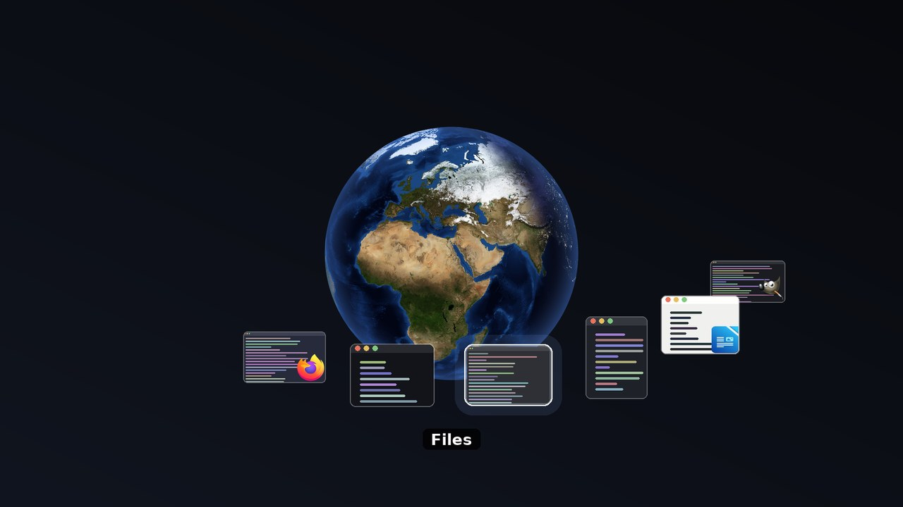

# globeswitcher

An Alt+Tab window switcher built around a **rotating Earth**, drawn from NASA
satellite imagery and lit by the real position of the sun.



Your open windows ride on a ring around the globe's equator, each one shown as
a live picture of what is inside it. Each Tab rolls the globe one step, so the
next window comes round to the front and the rest travel with it. A few windows
sit together as a band across the equator; it takes something like twenty
before the ring closes and they wrap right around the world, with the far side
passing behind the Earth. The daylight on the globe is the daylight happening
right now, so while you pick a window you can see which half of the world is
awake.

It is a plain X11 program, not a desktop extension. Nothing is plugged into
GNOME Shell, so there is nothing to break when GNOME updates, and it works the
same on Xfce, KDE on X11, i3 or a bare window manager.

It is a companion to [globewallpaper](https://github.com/maxbrito500/globewallpaper),
which puts the same imagery on your desktop background. Neither needs the
other, but installing both means the NASA imagery is only downloaded once.

## Keys

| Key | Action |
|---|---|
| `Alt+Tab` | open the switcher and roll the next window to the front |
| `Shift+Alt+Tab` | open backwards, roll the other way |
| `→` `↓` / `←` `↑` | keep rolling while it is open |
| release `Alt` | activate the window at the front |
| `Escape` | close without switching |
| `w`, `q` or `F4` | close the window at the front |

Windows are offered in most-recently-used order, so a single Alt+Tab flips
between the last two windows, the way every other switcher behaves.

## Requirements

- An **X11** session. Wayland gives no way to list or raise other windows, so
  there is nothing this program could do there
- `python3` with `numpy` and `Pillow`
- A window manager that supports EWMH, which in practice means all of them

On Debian/Ubuntu:

```sh
sudo apt install python3-numpy python3-pil
```

## Install

```sh
git clone https://github.com/maxbrito500/globeswitcher.git
cd globeswitcher
./install.sh
```

The installer copies the program into `~/.local/share/globeswitcher`, renders
the first world map, starts the daemon, and adds it to `~/.config/autostart`
so it comes back on login.

X11 only lets one program grab a given key, so whatever your desktop has bound
to Alt+Tab has to let go of it first. On GNOME the installer does that for you
and saves the old value; on other desktops, clear Alt+Tab in your keyboard
settings yourself.

## Uninstall

```sh
./uninstall.sh
```

This stops the daemon, restores the Alt+Tab binding it took, and deletes
everything it installed.

## How it works

**The map.** `tools/globe-texture` renders a 2048x1024 equirectangular image
from NASA's *Blue Marble* (day) and *Black Marble* (night lights). Each pixel
is mixed according to the sun's elevation there, across a smoothstep twilight
band, so the terminator is a soft edge rather than a hard line. The subsolar
point comes from the low-precision solar formulas in the *Astronomical
Almanac* — no network service is involved, only your system clock. The imagery
is downloaded once and cached; everything after that works offline.

**The globe.** No GPU, no shader, no toolkit. Rotating a sphere whose texture
is an equirectangular map only shifts the longitude, so the mapping from screen
pixel to map row never changes and the mapping to map column changes by a
constant. Both are precomputed once, and each frame is then a single numpy
gather — about 7 ms for a 540-pixel globe.

**The windows.** Window `i` is pinned to longitude `i · 22°` on the equator,
and its position on screen is that point projected through the same camera the
globe is drawn with — lifted about 24° above the equator, looking north, which
keeps the ring a shallow band around the waist rather than an arc over the
poles. From its depth come two more things: windows nearer the viewer are
drawn larger, and the ones swinging round the back are dimmed.

The spacing is a fixed angle rather than `360°/n`. Dividing the circle would
fling four windows out to the four cardinal points and leave the globe ringed
by empty space; a fixed step keeps a handful of windows together in front of
you, and only closes the ring once there are enough of them to go the whole
way round. Above that the step shrinks to fit, and the tiles shrink with it.

Each one is drawn as a capture of the window's own contents, kept at its real
proportions so a wide window still reads as wide, with the application icon
badged in the corner. Captures are taken when you press Alt+Tab and kept for
twenty seconds, so a second Alt+Tab costs nothing; a per-open time budget
means a desktop full of windows cannot make the switcher slow to appear, and
anything left over falls back to the application icon until the next open.

Which windows are hidden needs no test for it. The far half is drawn first,
then the globe, then the near half; because the globe is opaque inside its
disc, a window crossing the limb is cut exactly at the silhouette.

**Rolling.** The selected window is whichever one faces you, so selection and
rotation are the same thing: pressing Tab picks the next window and sets the
globe's target angle to that window's longitude, and the globe eases there
over about a quarter of a second, always taking the shorter way round. A Tab
pressed mid-roll just retargets from wherever the globe currently is, so
holding Alt and drumming on Tab stays smooth instead of queueing up. Wrapping
from the last window back to the first has to travel the whole band, so that
roll is given proportionally longer — it reads as a turn rather than a jump.

**The window list.** Read from the X server through EWMH: `_NET_CLIENT_LIST`
for the windows, `_NET_WM_ICON` for the icons, `_NET_WM_NAME` for the titles,
and a `_NET_ACTIVE_WINDOW` message to raise the one you chose. X has no
most-recently-used list, so the daemon keeps its own by watching which window
the window manager makes active.

**The window on screen.** An override-redirect X window covering the screen,
which means no window manager touches it: it never lands in a taskbar and is
always on top, identically on every desktop. Instead of asking a compositor
for transparency, the daemon captures the screen when you press Alt+Tab and
dims it itself, so the switcher looks the same whether or not a compositor is
running.

Everything moves while the globe rolls, so there is no static background to
reuse — but everything that moves is inside one rectangle around the globe and
its ring. That rectangle is worked out once from the geometry, the dimmed
desktop under it is prepared once, and each frame redraws and pushes only
that.

Three things make 60 frames a second reachable in Python. The globe's rotation
is a whole-column shift of the map, so a frame is an integer add and one
`numpy.take` rather than any floating-point work. Compositing is 32-bit
integer arithmetic straight into numpy arrays, never through PIL images. And
the finished frame is written into a **MIT-SHM** buffer the X server already
has mapped, so handing it over costs nothing instead of pushing four megabytes
down a socket — that alone took a frame from 21 ms to 17 ms.

When the roll settles, drawing stops entirely and the daemon goes back to
blocking on X input.

## Configuration

Constants at the top of the source:

| File | Constant | Meaning |
|---|---|---|
| `globeswitcher/daemon.py` | `ROLL_DURATION` / `ROLL_DURATION_MAX` | Seconds to roll one window to the front, and the cap for a long wrap |
| `globeswitcher/daemon.py` | `FRAME_INTERVAL` | Frame pacing while rolling |
| `globeswitcher/daemon.py` | `CURRENT_DESKTOP_ONLY` | Hide windows on other workspaces |
| `globeswitcher/daemon.py` | `THUMBNAIL_TTL` / `THUMBNAIL_BUDGET` | How long captures are kept, and how long an open may spend taking them |
| `globeswitcher/globe.py` | `VIEW_TILT_RADIANS` | How far above the equator you look from |
| `globeswitcher/globe.py` | `MAX_TEXTURE_AGE_SECONDS` | How stale the map may get before a refresh |
| `globeswitcher/ui.py` | `GLOBE_FRACTION` | Globe diameter, as a share of the screen's short axis |
| `globeswitcher/ui.py` | `ORBIT_RADIUS` | Ring radius, in globe radii |
| `globeswitcher/ui.py` | `ANGULAR_STEP` | Angle between neighbouring windows |
| `globeswitcher/ui.py` | `DEPTH_SCALE` | How much nearer windows grow |
| `globeswitcher/ui.py` | `BACK_OPACITY` | Dimming of windows on the far side |
| `globeswitcher/ui.py` | `BACKDROP_DIM` | How much of the desktop's brightness remains |
| `globeswitcher/ui.py` | `BADGE_FRACTION` | Size of the application icon on a thumbnail |
| `tools/globe-texture` | `TWILIGHT_LO` / `TWILIGHT_HI` | Solar elevations bounding the twilight blend |

`ORBIT_RADIUS · sin(VIEW_TILT_RADIANS)` sets where the front window sits: near
1 it rests on the globe's lower rim, below that it starts to cover the globe's
face, and well above it the ring stops looking like a band around the equator.

After editing, re-run `./install.sh`.

## Testing

Render a switcher frame to a file, with invented windows and no real desktop
behind it:

```sh
python3 -m globeswitcher --demo /tmp/preview.png
```

Point the map generator at any moment in time, which makes the lighting easy
to check without waiting for the Earth to turn:

```sh
GLOBE_FAKE_UTC=2026-06-21T12:00 GLOBE_OUTPUT=/tmp/solstice.png \
    ./tools/globe-texture
```

At the solstices the solar declination should be near ±23.44°, at the
equinoxes near 0°, and at 12:00 UTC the sunlit centre sits near longitude 0°.

Trace what the daemon is doing:

```sh
pkill -f globeswitcher.__main__
GLOBESWITCHER_DEBUG=1 ~/.local/bin/globeswitcher
```

## Known limits

- **X11 only.** Wayland has no protocol for listing or activating another
  application's windows, short of a compositor-specific extension.
- The switcher is drawn on the primary screen's geometry; on a multi-monitor
  setup it covers the full X screen rather than one monitor.
- Thumbnails of windows that are buried behind others depend on a compositing
  window manager keeping their contents. Without a compositor an obscured
  window has nothing to capture, and it falls back to its application icon.
- Past about twenty windows the ring closes and the tiles start to overlap
  near the limbs, where the spacing foreshortens. They shrink to compensate,
  but only so far.

## Credits

Satellite imagery courtesy of [NASA Visible Earth](https://visibleearth.nasa.gov/):
*Blue Marble: Next Generation* and *Black Marble*. NASA imagery is in the
public domain and is downloaded at runtime — it is not redistributed by this
repository.

## Licence

Apache License 2.0 — see [LICENSE](LICENSE).
